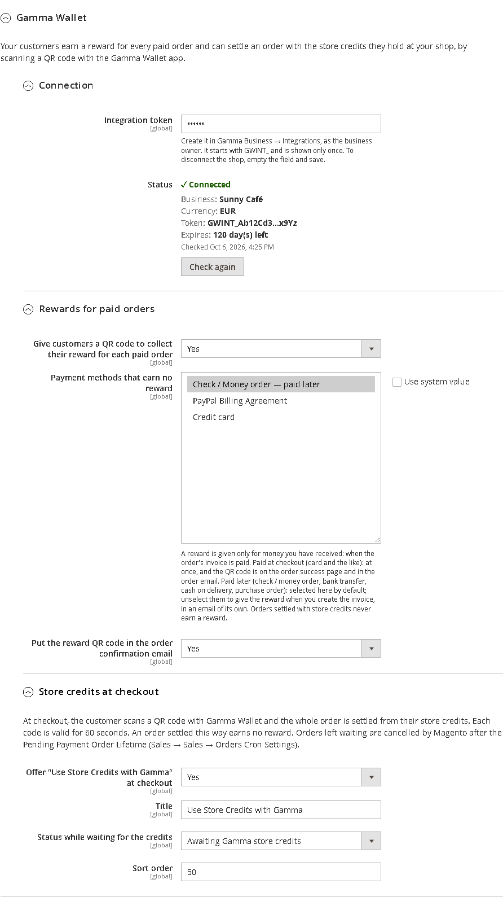
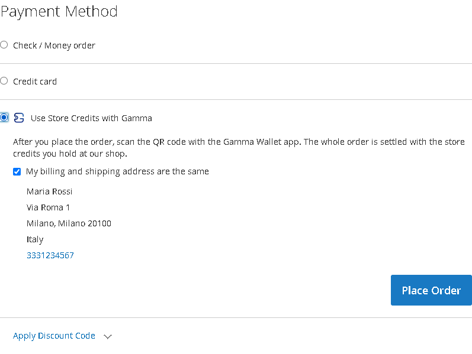
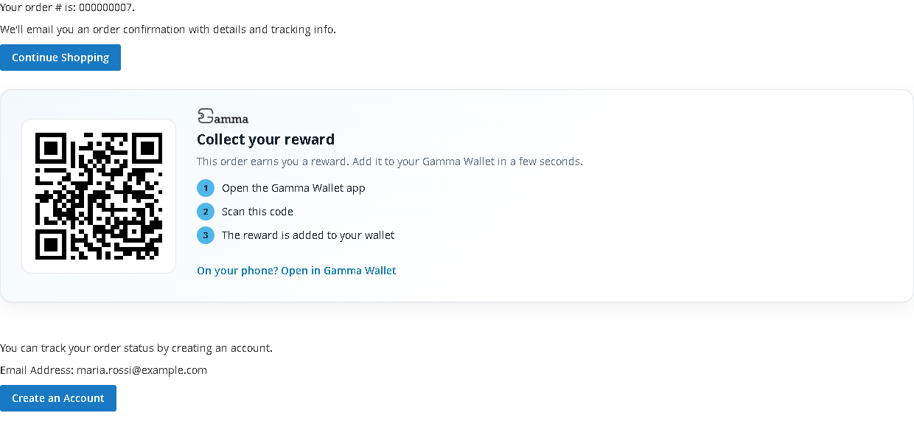
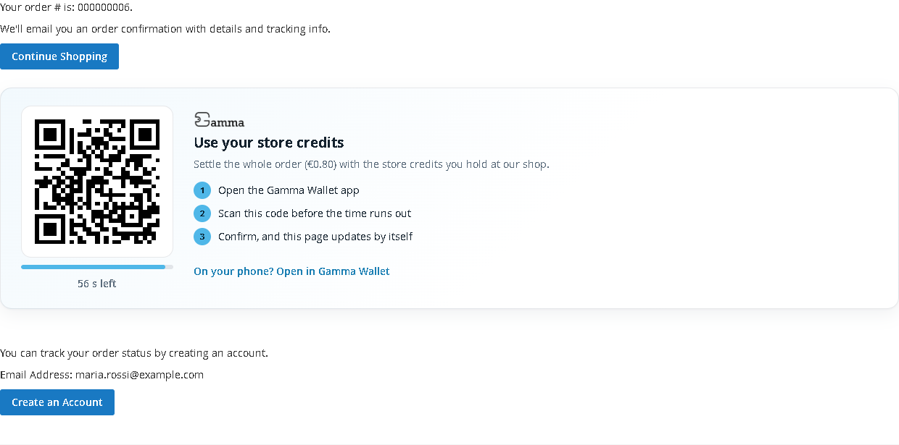
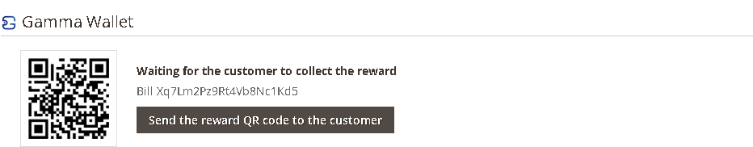

# Gamma Wallet for Magento

Use [Gamma Wallet](https://www.gamma-wallet.com) in your Magento shop. Once the module is installed:

- **Your customers earn a reward for every paid order.** After paying, they scan a QR code with the Gamma Wallet app and the reward is added to their wallet, under your business.
- **Your customers can use the store credits they hold at your shop.** At checkout they choose *Use Store Credits with Gamma*, scan a QR code, and the whole order is settled from their credits.

Credits are a promise of value at your business. They are not money and not crypto, and Gamma never handles any payment. Card payments, bank transfer and the rest keep working exactly as they do today.

This guide is for shop owners. Installing a Magento module needs access to your server's command line, so the first step is usually done by your developer, agency or hosting provider; everything after that is in the Magento admin, with no coding. If you want to connect your own software instead of Magento, see [byCode](https://github.com/Gamma-Wallet/Integrations-samples-/tree/main/byCode).

---

## Contents

1. [What you need](#1-what-you-need)
2. [Install the module](#2-install-the-module)
3. [Create your integration token in Gamma Business](#3-create-your-integration-token-in-gamma-business)
4. [Connect your shop](#4-connect-your-shop)
5. [Choose which orders earn a reward](#5-choose-which-orders-earn-a-reward)
6. [Store credits at checkout](#6-store-credits-at-checkout)
7. [What your customers see](#7-what-your-customers-see)
8. [Your orders](#8-your-orders)
9. [Renewing your token](#9-renewing-your-token)
10. [Questions and answers](#10-questions-and-answers)
11. [When something is wrong](#11-when-something-is-wrong)

---

## 1. What you need

| | |
|---|---|
| A Gamma Business account with a **Reward** service active | [Register](https://business.gamma-wallet.com) and start on the free tier, then activate a Reward service. The module works only with a Reward service: while another kind of service is active (a membership or a discount card, for example), customers get no reward QR code and store credits are not offered at checkout. |
| Magento | **Magento Open Source 2.4.6 to 2.4.8**, or Adobe Commerce on your own server or on Adobe's cloud (PaaS), with PHP 8.1 to 8.4. Tested with 2.4.8 and the standard Luma theme and checkout. Adobe Commerce as a Cloud Service (SaaS) does not accept modules like this one. |
| The same currency | Your shop must sell in the same currency as your Gamma business (for example EUR in both). |
| Email and cron | Your shop must be able to send email, so customers receive their reward, and Magento's cron must be running (it normally is). |

## 2. Install the module

Give these steps to whoever looks after your Magento server. Either way works.

**With Composer (recommended)**, from the Magento root folder:

```bash
composer config repositories.gamma-wallet vcs https://github.com/Gamma-Wallet/Magento-Module
composer require gamma-wallet/module-gamma-wallet:^1.1
bin/magento module:enable Gamma_Wallet
bin/magento setup:upgrade
bin/magento cache:flush
```

**Or from the zip:** download **[gamma-wallet-magento.zip](gamma-wallet-magento.zip)** (on GitHub, open the file and click *Download raw file*), unzip it in the Magento root folder (it creates `app/code/Gamma/Wallet`), then run the last three commands above.

A shop in production mode also needs `bin/magento setup:di:compile` and `bin/magento setup:static-content:deploy` before the cache flush, as after any module install.

Magento's **cron must be running** (it is on any normal Magento server): the module uses it to retry rewards, to keep the connection check fresh, and to settle store-credit orders whose customer closed the page.

Only orders placed **after** the module is installed earn rewards; older orders never do.

**Updating:** `composer update gamma-wallet/module-gamma-wallet` (or replace the folder from the new zip), then `bin/magento setup:upgrade` and `bin/magento cache:flush`.

## 3. Create your integration token in Gamma Business

The token is the key that lets your shop talk to your Gamma business. You never give the module your password.

1. Sign in to [Gamma Business](https://business.gamma-wallet.com) as the business owner.
2. Open **Integrations**.
3. Click **Create token** and choose how long it stays valid (up to one year).
4. **Copy the token now.** It starts with `GWINT_` and is shown only once.

Keep the token private, like a password. Anyone who has it can create rewards for your business. If you think it has leaked, disable it in **Integrations** and create a new one.

## 4. Connect your shop

1. In the Magento admin, go to **Stores → Configuration → Sales → Payment Methods** and open **Gamma Wallet**.
2. Paste the token into **Integration token**.
3. Click **Save Config** at the top.

Under **Status** you should now see **✓ Connected**, your business name, your currency and how many days the token has left. If a red line says your business has no Reward service active, activate one in Gamma Business, then click **Check again**.



After saving, the field shows only dots; that is on purpose, so the token can't be read back from the page. Magento stores it encrypted. To change it, paste a new one and save. To disconnect the shop, empty the field and save.

## 5. Choose which orders earn a reward

Under **Rewards for paid orders**:

- **Give customers a QR code…**: turns rewards on or off for the whole shop.
- **Payment methods that earn no reward**: the payment methods selected here never earn a reward. Hold *Ctrl* (or *Cmd*) to select several.
- **Put the reward QR code in the order confirmation email**.

The rule is simple: **a reward is given only for money you have actually received**, which in Magento means the order's invoice is paid.

| Payment method | When the reward is given | Where the customer finds the QR code |
|---|---|---|
| Paid at checkout (card, PayPal and the like) | At once: the payment is captured while the order is placed | On the order success page and in the order confirmation email |
| Paid later: check / money order, bank transfer, cash on delivery, purchase order | Only when **you** create the invoice, meaning you have received the money | In an email of its own, sent once at that moment |
| Store credits (*Use Store Credits with Gamma*) | Never: the customer used their credits rather than paying | — |

The paid-later methods are selected in the list by default, so they earn no reward. Unselect them if you want those orders to earn a reward once you create the invoice. The same applies to a card payment your shop only authorises and captures later: the reward follows the invoice and arrives by email.

The reward the customer receives follows the Reward service you have active in Gamma Business. You don't set amounts in Magento.

## 6. Store credits at checkout

*Use Store Credits with Gamma* is turned on when the module is installed. You can turn it off under **Store credits at checkout** in the settings, and change its title and its position among the payment methods. Customers see it in the payment step:



While the customer settles the order, it waits in the status **Awaiting Gamma store credits**, which the module adds to your shop. Once settled, the order gets its invoice and moves to *Processing*, like any paid order.

Good to know:

- Store credits always cover the **whole** order. A customer who doesn't hold enough credits at your shop can't complete it with their credits and places a new order with another payment method.
- The option is shown only when your shop is connected, your business has a Reward service active, the currency matches and the order total is above zero.
- An order settled with store credits doesn't earn a new reward.
- The order confirmation email is sent once the order is settled, not before.
- If the customer confirms in the app and closes the page straight away, the order is still settled: Magento's cron asks Gamma every couple of minutes about orders waiting for credits.
- If an order is paid with credits after it was cancelled (by you, or by Magento's lifetime limit), it is not changed: you get an admin notification and a note on the order, because the customer has used their credits.
- An order nobody settles is cancelled by Magento after the *Pending Payment Order Lifetime* (**Stores → Configuration → Sales → Sales → Orders Cron Settings**, 8 hours by default).

## 7. What your customers see

### An order paid at checkout

The order success page shows the reward. The customer opens the Gamma Wallet app, scans the code, and the reward is added to their wallet. The same code is in their order confirmation email, so they can scan it later from another device.



On a phone, *Open in Gamma Wallet* opens the same reward without scanning. The reward is also on the customer's order page, under **My Account → My Orders** (or *Orders and Returns* for guests).

### An order paid later

The success page says that a QR code will follow by email. When you create the invoice, the customer receives the email *Your reward from (your shop) (order …)* with the QR code.

### An order settled with store credits

After placing the order, the customer sees a QR code with a countdown. They scan it with the Gamma Wallet app and confirm. The page updates by itself, the order moves to *Processing* with a note in its history, and the order confirmation email goes out.



Each code is valid for **60 seconds**. If time runs out, the customer gets a button to show a new code.

### Guests

Customers don't need an account in your shop. The reward QR code is on the success page and in the email that goes to the address they gave at checkout. They only need the free Gamma Wallet app.

## 8. Your orders

Every order has a **Gamma Wallet** box on its page in **Sales → Orders**, under the order and account information. It tells you where things stand:

- *Waiting for the customer to collect the reward*, with the QR code (you can show it to a customer standing in front of you)
- *Reward collected*
- *Paid later: when you create the invoice, the reward QR code is created…*
- *Waiting for the customer to settle it with store credits*, or *Settled with store credits through Gamma Wallet*
- an error message, if the reward could not be created (see [section 11](#11-when-something-is-wrong))



**Sending the reward again.** If a customer lost the email, click **Send the reward QR code to the customer** in the box. Each order has exactly one reward, and it can be collected only once; sending it again doesn't create a second reward. Admin users need the *Gamma Wallet: send the reward QR code* permission (under *Sales → Operations → Orders* in the user roles).

## 9. Renewing your token

Every token has an end date. The settings page shows how many days yours has left, so look at it now and then.

To renew:

1. In Gamma Business → **Integrations**, click **Replace token** and copy the new one.
2. Paste it in the Gamma Wallet settings and click **Save Config**.

Do both steps together. **The old token stops working the moment you create the new one**, and you can create one token every 24 hours.

## 10. Questions and answers

**Does Gamma take a share of my sales or touch the payment?**
No. Customers pay you exactly as before, through the payment methods you already use. Gamma only records the reward contract for the order. A customer who uses store credits is using value you promised earlier, not paying Gamma.

**What does the module send to Gamma?**
Every request carries your integration token and the module version. For each order that earns a reward or uses store credits: an order reference (such as *MG-3f9a1c-000000042*: your order number with a short tag for your shop), the total, the currency, the order date, and the name of the platform (Magento). About once an hour it checks the connection. No names, addresses, email addresses or products.

The reward QR code image on the order pages, in the order emails and on the admin order page is loaded from `integration.gamma-wallet.com`, so the customer's browser or email app contacts that server when it shows it. Mention this in your shop's privacy policy. The module lists that host in Magento's Content Security Policy, so the image also shows when your CSP is strict.

**When exactly is the reward given?**
When the order is paid in full: its invoices cover the whole total. A first partial invoice is not enough.

**I run several stores in one Magento installation.**
The module connects one Gamma business per Magento installation, and all its stores use it. Orders in a currency other than your Gamma business's earn no reward and can't use store credits.

**My customer doesn't have the Gamma Wallet app yet.**
They install the free Gamma Wallet app, sign up, and scan the code from the success page or the email.

**Can a customer collect the same reward twice, or collect someone else's?**
No. Each order's reward can be collected once, by the first person who scans it. Customers should treat the code like a voucher.

**An order is refunded or cancelled. What happens to the reward?**
The module doesn't take a reward back. If the order already had a reward, its QR code still works until the customer collects it, and a collected reward stays in their wallet. For paid-later orders, you avoid this by creating the invoice only once you have the money.

**Does it work with Hyvä or a headless (PWA) storefront?**
Rewards are created on the server, so they work with any storefront, and they always arrive in the order emails. The success-page boxes and the *Use Store Credits with Gamma* option are built for the standard Luma theme and checkout; other storefronts need their own small adaptation.

**What happens if I remove the module?**
New rewards stop and the store credits option disappears. Rewards already given stay in your customers' wallets. Removed with `bin/magento module:uninstall Gamma_Wallet` (Composer installs), the module's settings, including your integration token, are deleted. The status *Awaiting Gamma store credits* and the module's order table stay, because past orders use them.

## 11. When something is wrong

| What you see | What to do |
|---|---|
| **Status** says the token is not valid, expired or disabled | Create a new token in Gamma Business → Integrations and paste it in. |
| *… works only with a Reward service* | Your active service in Gamma is not a Reward service. Activate a Reward service in Gamma Business. The module checks again every hour; click **Check again** to see the change at once. |
| *Your shop sells in … but your Gamma business uses …* | The currency your customers pay in (**Stores → Configuration → General → Currency Setup**, default display currency) must be the same as your Gamma business currency. |
| *Use Store Credits with Gamma* is missing at checkout | Check that it is turned on in the settings, that **Status** shows *Connected* with no red line about the Reward service, that the currencies match and that the total is above zero. |
| An order has no reward | Check that your business has a Reward service active, that the payment method is not selected under *Payment methods that earn no reward*, that **Rewards** is on, that the order is paid in full, and that it was placed after the module was installed. The order's Gamma Wallet box gives the reason. |
| An error in the order's Gamma Wallet box | Fix the cause it names (usually the token), then click **Send the reward QR code to the customer**: this creates the reward and emails it, also after the automatic tries have run out. Passing errors are also retried by Magento's cron every 15 minutes. |
| An order paid with store credits still waits | Open it in the admin: the Gamma Wallet box asks Gamma at once. Check that Magento's cron is running; it settles such orders every couple of minutes. |
| *Gamma could not be reached* | Your server must allow outgoing connections to `https://integration.gamma-wallet.com`. Ask your hosting provider if this message stays. |
| *Too many requests to Gamma* | Wait a minute and try again. |
| The reward email didn't arrive | Ask the customer to check their spam folder, then send it again from the order. If none of your shop's emails arrive, the problem is your shop's mail settings, not the module. |

The module writes its problems to `var/log/system.log`, with lines starting `Gamma Wallet:`, which you can share with support.

Still stuck? Contact us through [gamma-wallet.com](https://www.gamma-wallet.com).

---

The module's source code is in this repository (the module root is the repository root). It is released under the Open Software License 3.0 (OSL-3.0), like Magento Open Source itself.
